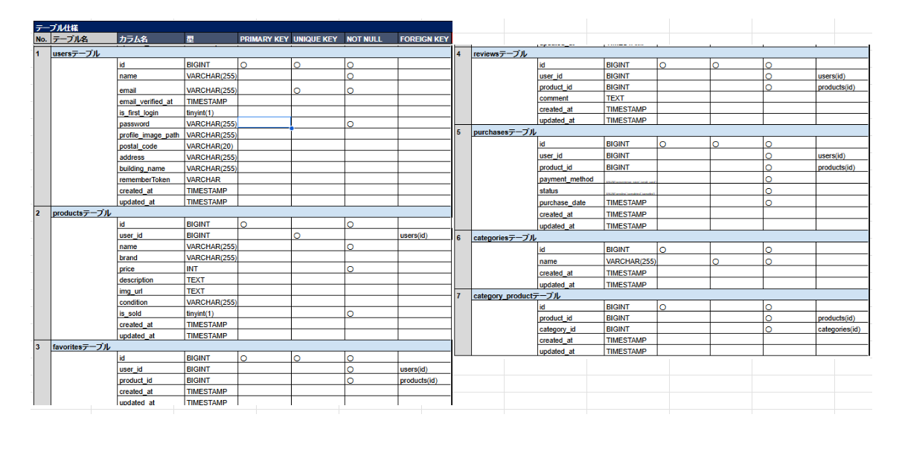
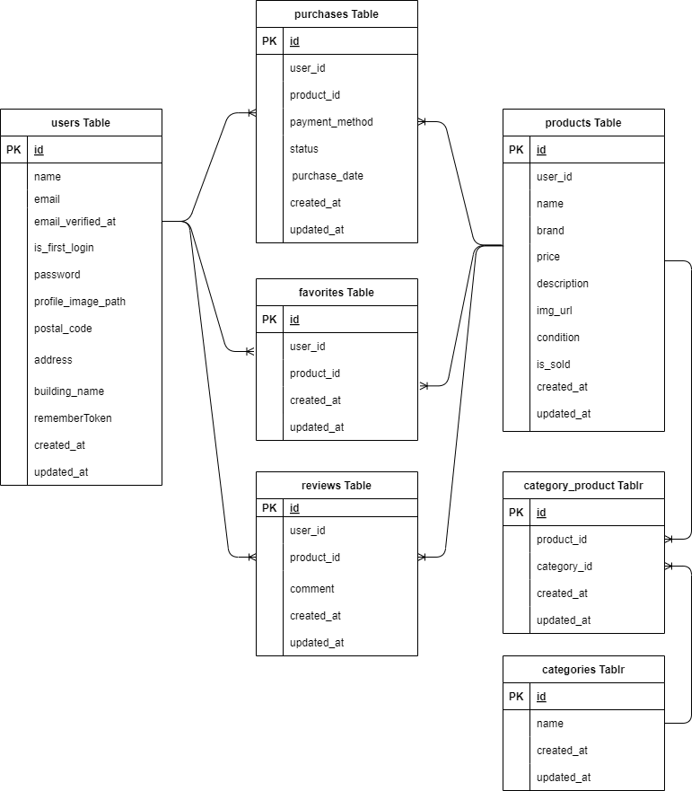

<p align="center"><a href="https://laravel.com" target="_blank"></a></p>

<p align="center">
<a href="https://travis-ci.org/laravel/framework"></a>
<a href="https://packagist.org/packages/laravel/framework"></a>
<a href="https://packagist.org/packages/laravel/framework"></a>
<a href="https://packagist.org/packages/laravel/framework"></a>
</p>

# フリーマーケットアプリ - coachtechフリマ

**coachtechフリマ**は、簡単に商品を出品・購入できるフリーマーケットアプリです。お気に入り機能やレビュー投稿機能を提供します。


## 作成した目的

実務に近い開発経験を積むために作成しました。

## アプリケーション URL

http://13.231.189.129

## 機能一覧

-   会員登録・ログイン・ログアウト
-   プロフィール設定機能
-   商品検索機能
-   商品詳細表示
-   マイリスト機能　　
-   商品出品・購入機能
-   コメント送信・閲覧機能
-   いいね登録機能
-   配送先変更機能
-   決済機能

**追加機能**

-   メール認証機能（mailhog）　　
-   バリデーション
-   環境の切り分け（ローカル・本番）
-   レスポンシブ対応
-   AWS を利用したデプロイ

## **🛠️ 使用技術**

- **フレームワーク**: Laravel 8.x
- **データベース**: MySQL 8.x
- **サーバー**: Nginx
- **PHP**: 8.4.2
- **Node.js**: 18.x
- **Composer**: 2.x
- **Docker**
- **Stripe**（決済）
- **OS**: Ubuntu 20.04
- **その他**: AWS（S3, EC2, RDS）

## テーブル設計



## ER 図

以下は、本プロジェクトで使用しているデータベースの ER 図です：




## 環境構築手順

### ** ローカル環境の場合**
**ローカル環境では、以下のディレクトリで作業します。**
```bash
git clone https://github.com/thankschiemi/fleamarket0114.git
cd fleamarket0114
```

### ** 本番環境（AWS EC2）の場合**
**AWS EC2（本番環境）では、既に `/var/www/html/src` にデプロイ済みです。**
作業ディレクトリに移動してから、環境構築を行ってください。
```bash
cd /var/www/html/src
```

---

### 1️⃣ **（Docker環境の場合のみ）コンテナ内に入る**
**Docker を使用する場合は、以下を実行！**
```bash
docker-compose exec php bash
```
 **ローカル環境の場合は、この手順は不要！**

### 2️⃣ **環境設定ファイルを作成**
```bash
cp .env.example .env
nano .env  # 設定を編集
```

### 3️⃣ **アプリケーションキーを生成**
```bash
php artisan key:generate
```

### 4️⃣ **必要な依存関係をインストール**
```bash
composer install
npm install
npm run dev
```

### 5️⃣ **データベースをマイグレーション**
```bash
php artisan migrate --seed
```

---

## ** テスト用ユーザー情報**
データベースをリセットすると、以下のユーザーが作成されます。

| 項目 | 値 |
|------|----|
| **メールアドレス** | `default@example.com` |
| **パスワード** | `password` |

📌 **このアカウントでログインして、アプリをテストできます！**


## ライセンス

このプロジェクトは、MIT ライセンスの下で公開されています。

## 作者

-   **名前**: 鈴木 智恵美
